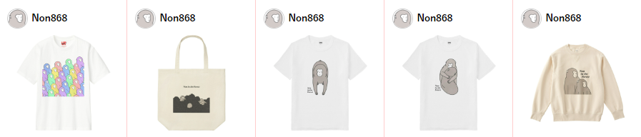

# その他
我田引水になるが、その他ヤクシマザルに関することを紹介する。

## X (Twitter)
筆者は[\@tabutan_primate](https://twitter.com/tabutan_primate)で、長期観察することでわかるようなヤクシマザルの情報発信を行っている。 

## LINEスタンプ
あるヤクシマザルの研究者がサルらしい日々の情景をLINEスタンプにしている（[まるさるスタンプ](https://store.line.me/stickershop/product/25103401/ja)、図 \@ref(fig:marusaru)）。筆者が企画から携わり監修したスタンプで、サルが見せる場面の中からスタンプとして使いやすいように工夫してみた。まるさるスタンプの絵を描いた人のアカウントはこちら（[Instagram](https://www.instagram.com/non_in_the_forest?igsh=Z284cmljcXg4YXd0)）。

```{r marusaru, out.width = "30%", fig.align = "left", echo = FALSE, fig.cap = "LINEスタンプのイメージ図"}
knitr::include_graphics("image/marusaru.png")
```

## UTme!
LINEスタンプだけでなく、ユニクロが運営するUTme!でTシャツなどもある（図 \@ref(fig:UTme)）。好きなデザインを選び、アイテム・色・サイズの3要素の組み合わせから楽しめる（[こちら](https://utme.uniqlo.com/jp/front/mkt/show?id=1002353&locale=ja)）。

```{r UTme, out.width = "150%", out.height="120%", fig.align = "left", echo = FALSE, fig.cap = "UTme!の商品サンプル"}

```


