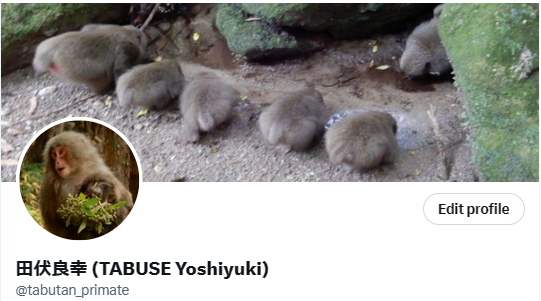

# ニホンザルのトリビア
ここではニホンザルの話題を紹介する。

## ニホンザルの学名
>ニホンザルの学名は元々"*Macaca speciosa*"であった[@iwamoto1985]

"*Macaca speciosa*"は1826年に記載され[@geoffroy1826]、"*Macaca fuscata*"の記載[@blyth1875]より古い。しかし誤ってベニガオザルに使われてきた歴史が長く、現在は混乱を防ぐため両者ともに使われていない。*Macaca speciosa*の種名は「目立つ、すばらしい」という意味だが、*Macaca fuscata*は対照的に「暗色がかった」という意味。命名する学者によって印象がだいぶ違うらしい・・・。<br>
ちなみにベニガオザルの学名は*Macaca arctoides*、「クマのような」の意味。


## ヤクシマザルのお隣さん
>屋久島の隣にある種子島には大正時代ニホンザルがいた[@hanya2000]

1923年に種子島にニホンザルがいたことが、当時東北帝国大学教授であった長谷川言人による全国アンケートによって明らかになっている。屋久島と種子島は約20kmしか離れておらず、同じ亜熱帯地域であるため気温はほぼ同程度の傾向でありながら降水量が大きく異なる。林芙美子の小説『浮雲』[@hayashi_ukigumo]には屋久島は「月に三十五日も雨が降る」と表現されるほどである（図 \@ref(fig:TaneYakuClimate), *c.f.* [気象庁の観測データ](https://www.data.jma.go.jp/gmd/risk/obsdl/)）。このような生態学的観点から、霊長類学が始まる戦後も種子島のニホンザルが生き残っていれば、屋久島と種子島での比較研究は興味深かっただろう。

```{r, TaneYakuClimate, message=FALSE, warning=FALSE, echo=FALSE, fig.cap="屋久島と種子島の気象データの比較<br>公開されている気象庁の過去の観測データからダウンロードし分析した。分析データは、屋久島観測所（＠屋久島町小瀬田）と種子島観測所（＠西之表市西之表）のデータ、2020年から2022年までの3年間のデータを用いた。"}
library(tidyverse)


y1.lim <- c(0,35) #左軸気温
y2.lim <- c(0,3500) #右軸降水量

scaler <- (y2.lim[2] - y2.lim[1])/(y1.lim[2] - y1.lim[1])


read_csv("data/taneyaku_climate20_22.csv", skip = 6) %>% 
  drop_na() %>% 
  group_by(site, month) %>% 
  summarise("temp_max_month" = max(temp_max),
            "temp_mean_month" = mean(temp_mean),
            "temp_min_month" = min(temp_min),
            "rainfall_month" = sum(rainfall)/3,
            "wind_speed_month" = mean(wind_speed)) %>%
  pivot_longer(cols = temp_max_month:temp_min_month, 
               names_to = "temp_type", 
               values_to = "temp_month") %>% 
  mutate(site = str_replace_all(site, c("tane" = "種子島", "yaku" = "屋久島"))) %>% 
  ggplot() +
  facet_grid(~ site) +
  geom_bar(aes(x = month, y = rainfall_month), 
           stat = 'identity', fill = "grey60", 
           width = 0.7,
           breaks = seq(0,3500,500)) +
  geom_line(aes(x = month, y = temp_month*scaler, color = temp_type), size = 1) +
  scale_color_hue(name = "", labels = c(temp_max_month = "月最高気温", 
                                        temp_mean_month = "月平均気温", 
                                        temp_min_month = "月最低気温")) + 
  scale_x_continuous(breaks = seq(1,12,1)) +
  scale_y_continuous(limit = y2.lim, 
                     expand = c(0, 0), 
                     sec.axis=sec_axis(trans = ~ ./scaler, 
                     breaks = seq(y1.lim[1],y1.lim[2],5), 
                     name="気温 (°C)")) +
  labs(x = "月（2020年から2022年までの3年間の平均値）",
       y = "降水量 (mm)") +
  theme_bw(base_size = 16)+
  theme(axis.title.y = element_text(family = "Arial", size = 14.5),
        axis.text.x = element_text(family="Arial",
                                   face = "bold", size = 10.5),
        axis.title = element_text(family = "Yu Gothic",
                                  size = 20),
        legend.text = element_text(family = "Yu Gothic"),
        axis.text.y = element_text(family ="Arial"),
        plot.caption = element_text(family = "Yu Gothic")) 


```


# その他
我田引水になるが、その他ヤクシマザルに関することを紹介する。

## LINEスタンプ
あるヤクシマザルの研究者がサルらしい日々の情景をLINEスタンプにしている（[まるさるスタンプ](https://store.line.me/stickershop/product/25103401/ja)、図 \@ref(fig:marusaru)）。筆者が企画から携わり監修したスタンプで、サルが見せる場面の中からスタンプとして使いやすいように工夫を凝らした。


```{r marusaru, out.width = "30%", fig.align = "left", echo = FALSE, fig.cap = "サンプル"}
knitr::include_graphics("image/marusaru.png")
```


## X (Twitter)
筆者は[\@tabutan_primate](https://twitter.com/tabutan_primate)で、長期観察することでわかるようなヤクシマザルの情報発信を行っている（図 \@ref(fig:tabutan)）。 

```{r tabutan, fig.align = "left", echo = FALSE, fig.cap = "個人研究発信用アカウントサムネイル"}

```

